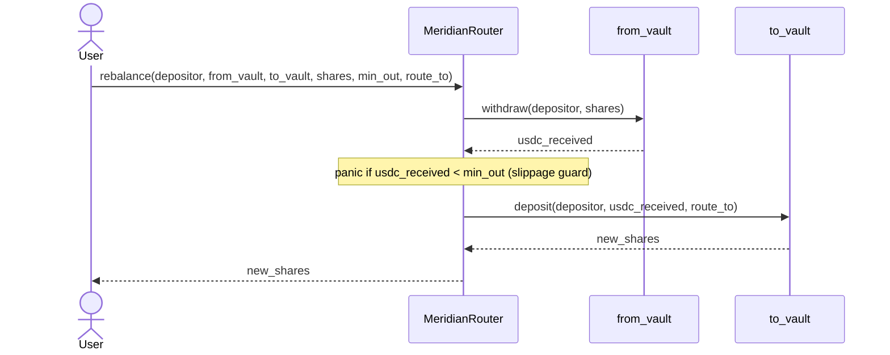

# Contracts

Meridian ships two Soroban contracts: a **vault** that holds user USDC and mints
share tokens, and a **router** that moves a user's position between vaults in a
single atomic transaction.

Both contracts live under `packages/contracts/` and are built with the same
Stellar CLI (`stellar contract build`). The deploy script at
`scripts/deploy-testnet.sh` builds, uploads, and deploys both.

## Vault (`meridian-vault`)

Source: [`packages/contracts/vault/src/lib.rs`](../packages/contracts/vault/src/lib.rs)

The vault is a share-based USDC custodian modelled on ERC-4626. Users deposit
USDC and receive mUSDC share tokens whose redemption value grows with yield
accrued in the underlying protocol (Blend or DeFindex).

A virtual share/asset offset of 1 000 stroops is applied to all price
calculations to neutralise the first-depositor inflation attack: an attacker
who donates USDC directly to the vault recovers only a negligible fraction of
the donation, making the skim unprofitable.

### Entry points

| Function | Description |
|---|---|
| `initialize(admin, usdc, musdc)` | One-time setup. Sets admin, USDC token, and mUSDC share token addresses. |
| `deposit(caller, amount, route_to)` | Pull `amount` USDC from `caller`, mint proportional mUSDC shares. Returns shares minted. |
| `withdraw(caller, shares)` | Burn `shares` mUSDC, send proportional USDC back to `caller`. Returns USDC sent. |
| `get_position(address)` | Current mUSDC share balance for `address`. |
| `get_principal(address)` | Net USDC deposited and not yet withdrawn (cost basis). |
| `get_entry_time(address)` | Ledger timestamp of the address's first deposit in the current position. |
| `get_active_protocol()` | The protocol hint set on the last deposit. |
| `get_total_assets()` | Total USDC held by the vault. |
| `get_total_shares()` | Total mUSDC shares outstanding. |
| `set_paused(paused)` | Admin-only. Block new deposits while leaving withdrawals open. |
| `set_admin(new_admin)` | Admin-only. Rotate the admin key without redeploying. |

### `Protocol` type

```rust
pub enum Protocol {
    Blend,
    DeFindex,
}
```

Passed to `deposit` to record which underlying protocol the funds should go to.
The vault stores the value but does not route funds itself - routing is the
responsibility of the off-chain API, which selects the best protocol and
includes the choice in the unsigned transaction it builds for the user to sign.

## Router (`meridian-router`)

Source: [`packages/contracts/router/src/lib.rs`](../packages/contracts/router/src/lib.rs)

The router provides a single `rebalance` entry point that moves a user's entire
position from one Meridian vault to another inside one Soroban transaction. If
any step fails, Soroban rolls back the entire transaction, so the user's
position is never partially migrated.

### How `rebalance` works



USDC flows through the depositor's account, not the router. After `withdraw`,
the USDC lands in the depositor's account. `deposit` then pulls it straight
into `to_vault`. The router never holds tokens.

### Entry point

```rust
pub fn rebalance(
    env: Env,
    depositor: Address,
    from_vault: Address,
    to_vault: Address,
    shares: i128,
    min_out: i128,
    route_to: Protocol,
) -> i128
```

| Parameter | Description |
|---|---|
| `depositor` | Address whose shares are burned. Must authorise this call. |
| `from_vault` | Vault contract to withdraw from. |
| `to_vault` | Vault contract to deposit into. |
| `shares` | mUSDC share count to burn on `from_vault`. |
| `min_out` | Minimum USDC stroops the withdrawal must return. Reverts on slippage. |
| `route_to` | Protocol hint forwarded to `to_vault.deposit`. |

Returns the number of shares minted by `to_vault`.

### Auth model

The depositor signs one transaction that covers the full call tree. Soroban's
hierarchical auth model propagates the signature to the `withdraw` and `deposit`
sub-invocations automatically. The `simulate_transaction` RPC call returns the
complete set of `SorobanAuthorizationEntry` objects the client must attach before
signing, so no special handling is needed in the frontend beyond the standard
`signTransaction` call already used for single-vault operations (see
[`docs/signing-flow.md`](signing-flow.md)).

### Slippage protection

`min_out` is a floor on the USDC the `from_vault` withdrawal must return. Pass
`1` to disable the check (accept any non-zero amount). The caller should compute
a sensible value by multiplying the current share redemption rate by
`(1 - slippage_tolerance)` and converting to stroops.

## Shared `Protocol` type

The router re-declares `Protocol` with the same `#[contracttype]` annotation and
variant names as the vault. Soroban serialises contracttype enums to XDR using
the variant name, so identical declarations produce identical wire bytes and
cross-contract calls work without sharing a crate.

## Building and deploying

```bash
# Build both contracts
cd packages/contracts
stellar contract build

# Deploy to testnet (requires DEPLOYER env var set to a funded secret key)
bash scripts/deploy-testnet.sh
```

The deploy script prints the deployed contract IDs. Add them to `.env` as
`VAULT_CONTRACT_ID` and `ROUTER_CONTRACT_ID`.
