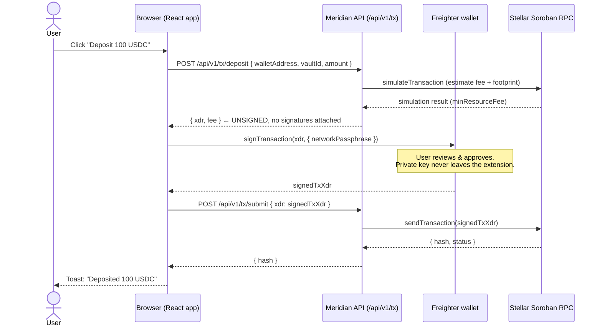

# Transaction signing flow

Meridian's core security property is simple: **the API never holds or sees a private key.**
It builds an *unsigned* Soroban transaction, returns it as a base64 XDR string, and the
browser hands that XDR to the user's wallet (Freighter) for signing. The signed XDR is then
relayed back through the API only to be forwarded to the Stellar network — the API still
never signs anything itself.

This document is the reference for anyone implementing the XDR builder (#14) or the Freighter
adapter (#8). Implement against this doc; you should not need to read the Soroban auth docs to
get the flow right.

## Sequence



## Why the API returns only an unsigned XDR

- **No custody, no liability.** The API has no access to a signing key, so a compromised API
  server cannot move user funds. The worst a malicious/compromised build endpoint can do is
  return a transaction the user can inspect and reject in Freighter.
- **The wallet is the trust boundary.** Freighter shows the user the operations and asset
  amounts before they approve. Signing happens inside the extension; the decrypted key never
  enters the page or the network.
- **The `/submit` endpoint only relays.** It accepts an *already-signed* XDR and forwards it to
  Soroban RPC via `sendTransaction`. It does not (and cannot) add signatures. Submitting could
  also be done straight from the browser to RPC; routing it through the API just centralises
  endpoint configuration and error handling.

## Endpoint reference

All bodies are JSON. `walletAddress` is a 56-character Stellar public key (`G...`).
Amounts (`amount`, `shares`) are decimal strings with up to 7 fractional digits
(e.g. `"100"`, `"12.5000000"`) — never numbers, to avoid float precision loss.

### `POST /api/v1/tx/deposit`

Builds an unsigned deposit transaction. Asserts the wallet holds the required USDC/mUSDC
trustlines first; if not, it throws and the frontend prompts the user to add them via
`POST /api/v1/tx/add-trustline`.

Request:

```json
{
  "walletAddress": "GABC...XYZ",
  "vaultId": "blend-usdc",
  "amount": "100"
}
```

Response `200`:

```json
{
  "xdr": "AAAAAg...base64-unsigned-envelope...",
  "fee": "10732"
}
```

- `xdr` — base64 transaction envelope, **unsigned**, already prepared via
  `assembleTransaction` (Soroban footprint + resource fee included).
- `fee` — the simulated `minResourceFee` in stroops, for display.

### `POST /api/v1/tx/withdraw`

Builds an unsigned withdraw transaction. `shares` is the amount of vault share token (mUSDC)
to redeem.

Request:

```json
{
  "walletAddress": "GABC...XYZ",
  "vaultId": "blend-usdc",
  "shares": "50"
}
```

Response `200`: same shape as deposit — `{ "xdr": "...", "fee": "..." }`.

### Error responses

Both endpoints return `400` with `{ "error": "<message>" }` for validation failures
(bad public key, malformed amount, missing fields), `503` if the vault contract is not
configured, and `500` with the simulation/build error message otherwise.

## What the frontend must do between receiving the XDR and submitting

1. **Resolve the network passphrase** for the active network
   (`"Test SDF Network ; September 2015"` for testnet,
   `"Public Global Stellar Network ; September 2015"` for mainnet). This must match the network
   the XDR was built for, or Freighter will produce an invalid signature.
2. **Sign** by calling Freighter's `signTransaction(xdr, { networkPassphrase })`. Read
   `signedTxXdr` from the result; throw on `result.error` (the user rejecting the popup is a
   normal, non-fatal outcome — swallow cancel/reject errors rather than surfacing them).
3. **Submit** the signed XDR via `POST /api/v1/tx/submit` with body `{ "xdr": signedTxXdr }`.
   The response is `{ "hash": "<tx-hash>" }`.
4. **Refresh state** — invalidate the user's `["positions", publicKey]` query so the new
   balance is reflected, and surface success/error to the user.

The browser-side wrappers live in
[`apps/web/src/lib/wallet.ts`](../apps/web/src/lib/wallet.ts) (signing) and
[`apps/web/src/lib/api.ts`](../apps/web/src/lib/api.ts) (build/submit calls); the orchestration
is in [`apps/web/src/hooks/useVaultActions.ts`](../apps/web/src/hooks/useVaultActions.ts).
